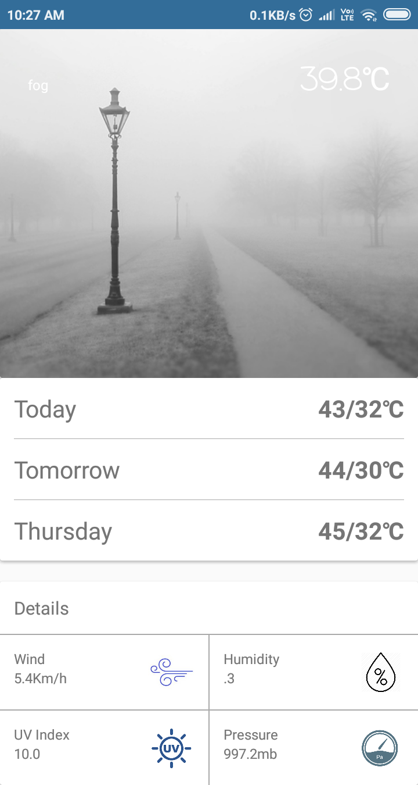

# WeatherApp
A weather forecasting android app.
Forecast weather for next three days.
shows following Details :
1. Wind Speed (in kilometer per hour)
2. Humidity
3. UV index
4. Pressure (in milibar)

Permission needed :

Internet Permission

Device location

Weather API used :
  DARK SKY API
  
Target SDK Version : 28

Minimum SDK Version : 15

Screen Shots :

